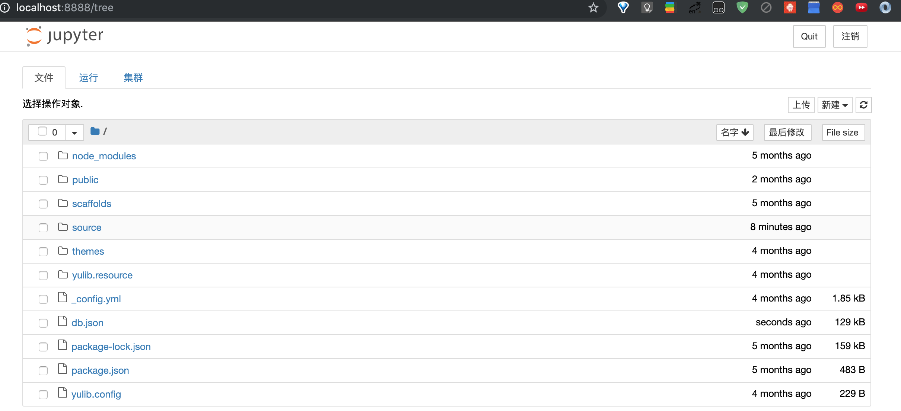
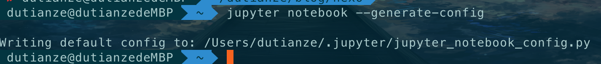
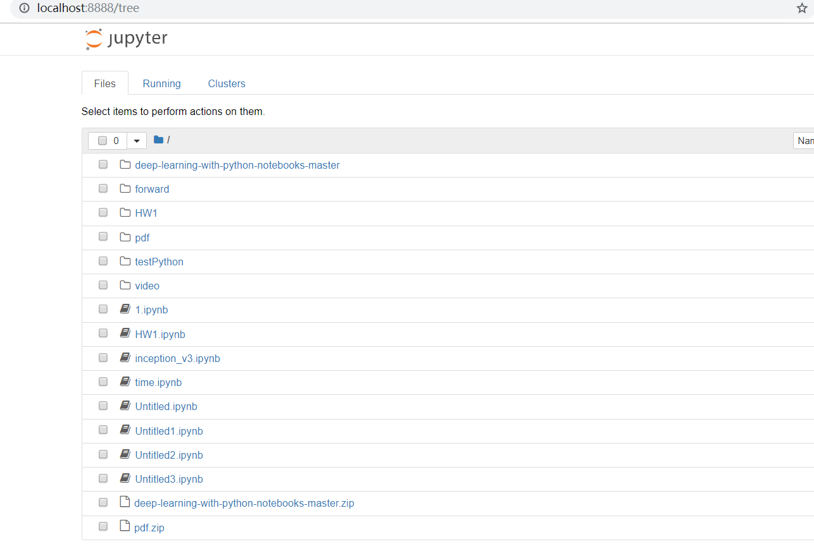
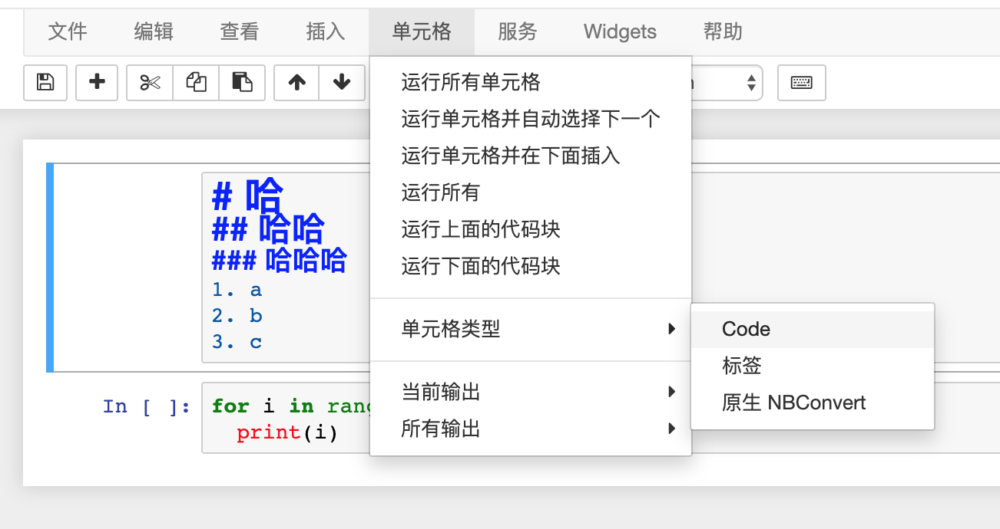
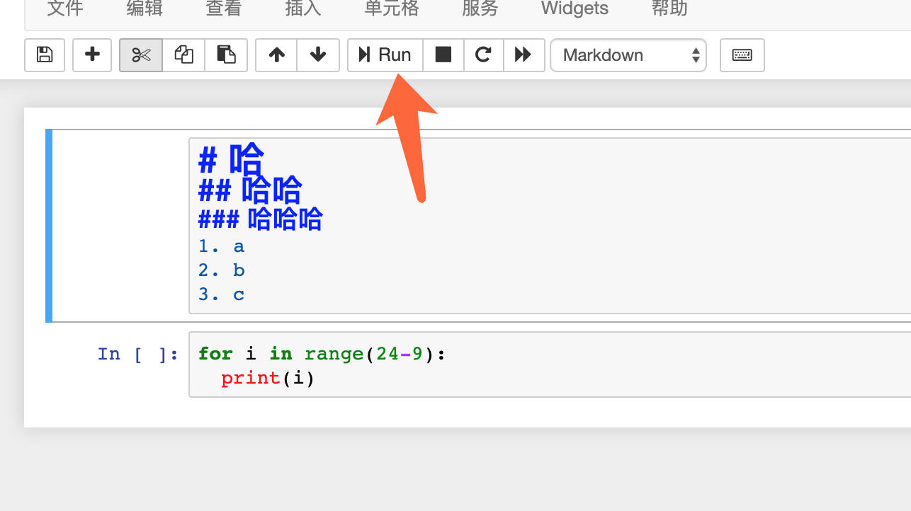
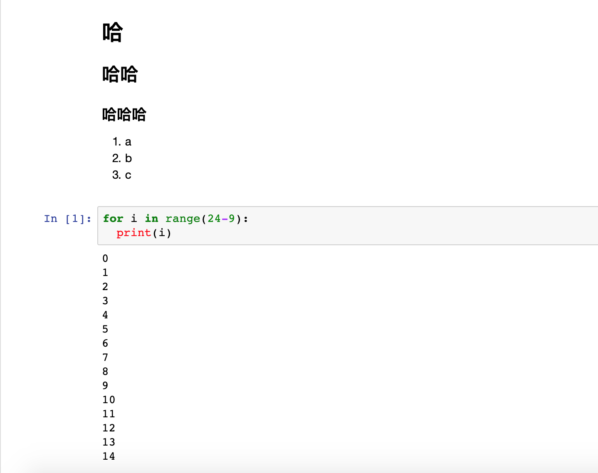

# 介绍

## Jupyter Notebook

Jupyter Notebook 是以网页的形式打开，可以在网页页面中直接编写代码和运行代码，代码的运行结果也会直接在代码块下显示的程序。如在编程过程中需要编写说明文档，可在同一个页面中直接编写，便于作及时的说明和解释。

## Jupyter Notebook 的主要特点

1. 编程时具有语法高亮、缩进、tab 补全的功能。
2. 可直接通过浏览器运行代码，同时在代码块下方展示运行结果。
3. 对代码编写说明文档或语句时，支持 Markdown 语法。
 <!--more-->

# 使用

## 安装

打开命令行输入

```shell
pip3 install jupyter
```

## 运行

打开命令行输入

```shell
jupyter notebook
```

命令行状态


浏览器自动跳转之后的状态


-   注意：之后在网页 jupyter 的所有操作，都请保持终端不要关闭，因为一旦关闭终端，就会断开与本地服务器的链接，你将无法在 Jupyter Notebook 中进行其他操作啦.

## 修改配置

有时候默认的位置并不方便你操作，你可以修改启动时，jupyter 使用的本地地址
打开命令行输入

```shell
jupyter notebook --generate-config
```

输入这个命令之后会告诉你产生了一个`jupyter_notebook_config.py`的文件.



按照提示的地址找到这个文件使用 _notepad++_ 打开文件，然后搜索 _notebook_dir_ , 修改为你要使用的地址。重新打开 jupyter，网页就是新的地址了


-   然后呢，你可以把从其他地方下载的 jupyter 文件放到这个目录下面，然后可以方便的打开运行啦

本地


jupyter



## 使用

jupyter 用来记笔记 单元格->单元格类型->标签


点击运行


可以看到标签的输出结果

