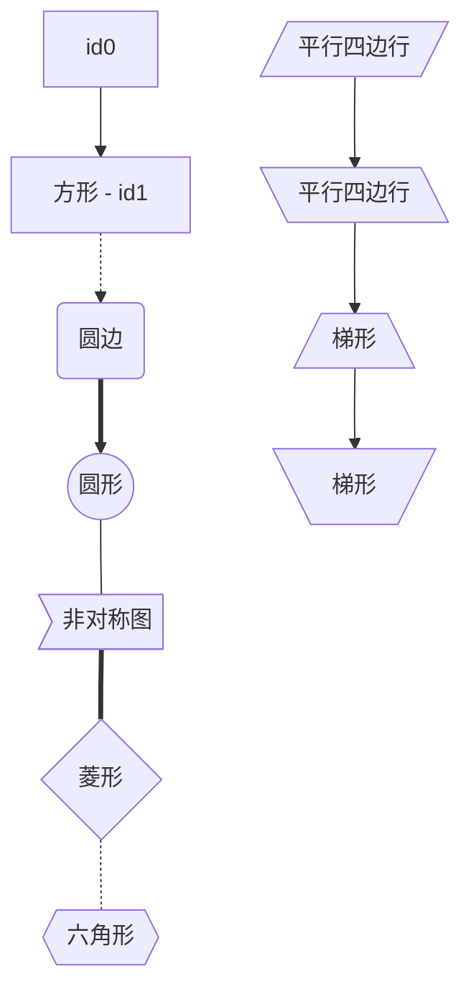
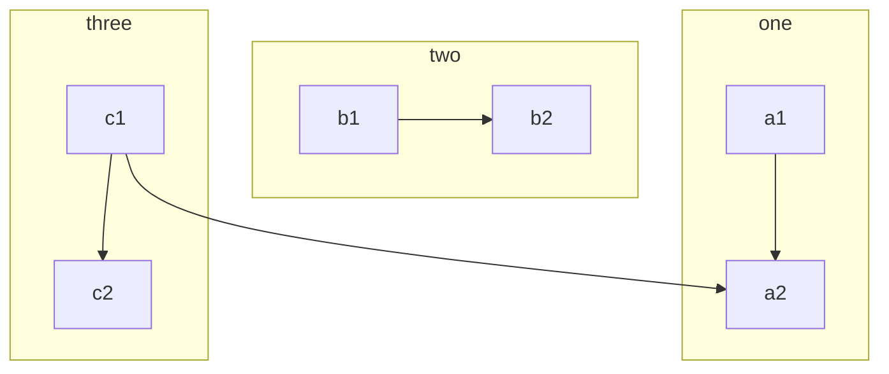
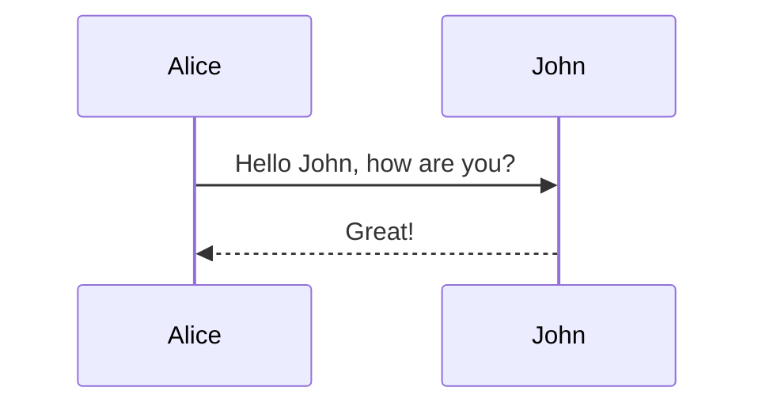
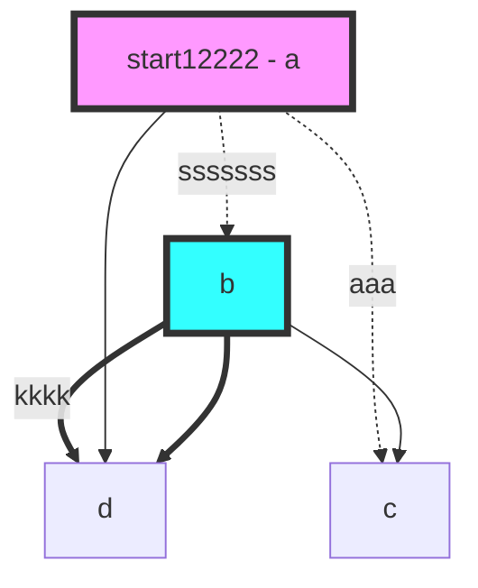

[TOC]

> Markdown 是一种轻量级的「标记语言」，它的优点很多，目前也被越来越多的写作爱好者，撰稿者广泛使用。看到这里请不要被「标记」、「语言」所迷惑，Markdown 的语法十分简单。常用的标记符号也不超过十个，这种相对于更为复杂的 HTML 标记语言来说，Markdown 可谓是十分轻量的，学习成本也不需要太多，且一旦熟悉这种语法规则，会有一劳永逸的效果。

# 1 概述

## 1.1 简介

Markdown 是一种轻量级标记语言，排版语法简洁，让人们更多地关注内容本身而非排版。它使用易读易写的纯文本格式编写文档，可与 HTML 混编，可导出 HTML、PDF 以及本身的 .md 格式的文件。因简洁、高效、易读、易写，Markdown 被大量使用，如 Github、Wikipedia 等网站，如各大博客平台：WordPress、Drupal、简书等。

## 1.2 Markdown 编辑器

推荐使用多平台的[atom](https://github.com/atom/atom/releases/tag/v1.42.0), 同时安装[markdown-preview-enhanced](https://shd101wyy.github.io/markdown-preview-enhanced/#/zh-cn/)插件

<!--more-->

# 2、基本语法

## 2.1 标题

```markdown
# 这是 <h1> 一级标题

## 这是 <h2> 二级标题

### 这是 <h3> 三级标题

#### 这是 <h4> 四级标题

##### 这是 <h5> 五级标题

###### 这是 <h6> 六级标题
```

## 2.2 强调

-   _斜体_

```markdown
_斜体_
_斜体_
```

-   **粗体**

```markdown
**粗体**
**粗体**
```

-   ~~横线删除~~

```markdown
~~横线删除~~
```

## 2.3 段落和换行

-   两个回车

```markdown
这是第一段

这是第二段
```

-   一段结尾加两个空格+回车

```markdown
这是第一段
这是第二段
```

-   使用 HTML 的语法`<br>`作为换行

## 2.4 分割线

```markdown
---
---

---
```

---

---

## 2.5 引用

```markdown
> 可以只用一个 “>” 号来写一个多行的引用，

> 也可以每一行都用一个 “>” 号
> 与上面一个效果

> > 还可以是嵌套引用，用多个“>”
```

## 2.6 列表

### 2.6.1 无序列表

无序列表可以在每行开头用 `*`、`+`、`-`来表示，也可以三者混合一起，推荐使用相同的字符，避免混乱。

```markdown
-   Item 1
-   Item 2
    -   Item 2a
    -   Item 2b
```

-   Item 1
-   Item 2
    -   Item 2a
    -   Item 2b
        -   a

### 2.6.2 有序列表

有序列表用数字接着一个英文句点来表示，数字可无序，但还是推荐使用 1.、2.，避免混乱。

```markdown
1. Item 1
2. Item 2
3. Item 3
    1. Item 3a
    1. Item 3b
```

1. Item 1
2. Item 2
3. Item 3
    1. Item 3a
    2. Item 3b

## 2.7 代码

### 2.7.1 行内代码块

这是一个代码`code` `aaa`

### 2.7.2 段落代码块

使用 \`\`\` 来表示代码块。

\`\`\`java
public static void main(String[] args) {
System.out.println("hello world");
}
\`\`\`

```java
public static void main(String[] args) {
    System.out.println("hello world");
}
```

## 2.8 链接

-   行内式

```
[GitHub](http://github.com)
```

[GitHub](http://github.com)

```
[GitHub][1]

* 参考式
[1]: http://github.com
```

[GitHub][1]

[1]: http://github.com

## 2.9 图片

```

```


## 2.10 表格

-   表格最简单的写法

| id  | name | score |
| --- | ---- | ----- |
| 001 | Mark | 90    |
| 002 | Ford | 80    |
| 003 | Alan | 95    |

```
id    |   name   |   score
---   |   ---    |   ---
001   |   Mark   |   90
002   |   Ford   |   80
003   |   Alan   |   95
```

-   用`:`对齐，`:`写在在`---`的左边就是左对齐，右边就是右对齐，两边都写就是居中。

| long_long_id | long_long_name | long_long_score |
| :----------: | :------------: | --------------: |
|     001      |      Mark      |              90 |
|     002      |      Ford      |              80 |
|     003      |      Alan      |              95 |

```
|long_long_id|long_long_name|long_long_score|
|    ---     |    :---:     |     ---:      |
|    001     |     Mark     |      90       |
|    002     |     Ford     |      80       |
|    003     |     Alan     |      95       |
```

# 3 拓展的语法

## 3.1 目录

添加`[TOC]`

## 3.2 脚注

```
Content [^1]

[^1]: Hi! This is a footnote
```

Content [^1]

[^1]: Hi! This is a footnote

## 3.3 上标

30^th^ a^b^

## 3.4 下标

30~th~ a~b~

## 3.5 标记

==marked==

# 4、数学

[语法参考 katex](https://katex.org/docs/supported.html)

```
$f(x) = sin(x)$

$$\sum_{n=1}^{100} {n + 1}$$

$$\overrightarrow{AB}$$
```

$f(x) = sin(x)$

$$\sum_{n=1}^{100} {n + 1}$$

$$\overrightarrow{AB}$$

# 5、图像

atom 插件`markdown-preview-enhanced`支持[mermaid](https://mermaid-js.github.io/mermaid/#/flowchart)

## 4.1 流程图

### 4.1.1 语法

\`\`\`mermaid
graph TD
a --> b
a --> c
\`\`\`

> 注意 以下省略 ```mermaid

-   方向

    -   TB - top bottom

    -   BT - bottom top

    -   RL - right left

    -   LR - left right

    -   TD - top down

-   线段

```
箭头直线
`A --> B`

没箭头直线
`A --- B`

线上加文字, 最好用双引号
`A--"This is the text"---B`

虚线
`A -.-> B`

虚线加文字
`A -."text".-> B`

粗直线箭头
`A == text ==> B`
```

-   图形形状

```
id

id1[方形]

id1(圆边)

id1((圆形))

id1>非对称图]

id1{菱形}

id1{{六角形}}

id1[/平行四边行/]

id1[\平行四边行\]

A[/梯形\]

B[\梯形/]
```



-   子图

```
subgraph title
    graph definition
end
```

#### 4.1.2 示例

```markdown
graph TB
c1-->a2
subgraph one
a1-->a2
end
subgraph two
b1-->b2
end
subgraph three
c1-->c2
end
```



### 4.2 顺序图

```markdown
sequenceDiagram
Alice->>John: Hello John, how are you?
John-->>Alice: Great!
```




